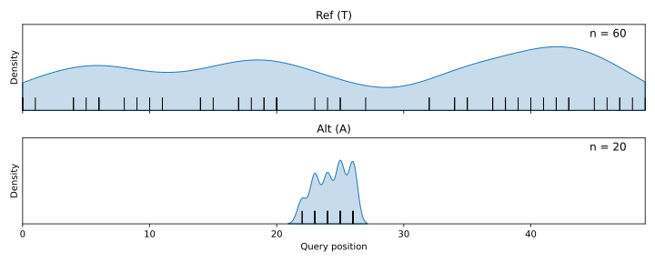
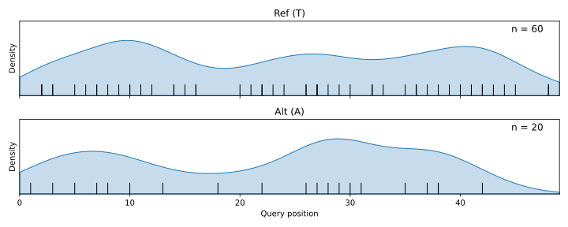
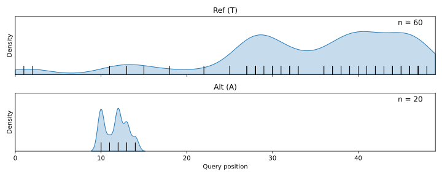

# Concepts & Theory

`expos` performs fast statistical assessment of spatial clustering in mutant reads and templates. The program implements Monte-Carlo simulation to assess deviation from both an idealised model of sequencing and a total set of reads covering a given variant. Ripley’s K, a standard metric in spatial inference, is used to evidence clustering, and effect sizes and p-values are reported. Since artefactual variants are disproportionately associated with regions of low sequence complexity, an estimate of the complexity of the reference region spanned by the supporting templates for a given variant is also reported. The complete statistical analysis reported may be encoded directly into a VCF and allows for robust flagging of these false-positive variants.

An idealised model of sequencing can be instructive in setting expectations against which to verify reads supporting a putative mutation. Assume paired-end sequencing, at a fixed read length. For a base sequenced to infinite read-depth in some sample under ideal conditions, an intuitive expectation is that the distribution of the query position of this base on the sequenced reads would approximate the uniform distribution. Or, in other words, we do not expect the sequencing process to dramatically prefer any particular genomic location around our base of interest, and, identically, it would be surprising for the reads covering the base to all exhibit that base at the same query position in each read. A corollary is that a similar principle must apply to the templates from which the reads were amplified – we do not expect homogeneity in their endpoint coordinates either. An extreme deviation from these expectations – identical endpoints between groups of reads and/or templates – forms the basis of duplicate marking as performed by samtools and biobambam. In essence, `expos` looks for deviation of this nature but using a reference distribution of reads covering the region rather than an idealised model.

## Spatial Clustering Walkthrough

expos looks for clustering in query position of variant supporting reads (and template endpoints).
Here's a simple example using a spatial density plot to show query position of the genomic location on the reads spanning that location:

It appears to be visually obvious that the mutant observations have much more tightly clustered query position as compared to the broadly distributed reference allele. However, if we are to mark this variant as likely artefactual, it is necessary to quantify this deviation (even in this exaggerated case). expos then asks the question: what is the likelihood that this variant supporting subset of query positions could have been drawn from the total set of reads? `expos` does so by taking random (equally sized) subsamples of the total set of reads and comparing the statistic in question between the random sample, and the variant supporting set. The following answer is given:

| Effect Size | p-value |
|-------------|---------|
| 17.5507     | 0.0004  |

expos uses a standardised z-score for effect size, measuring how many standard deviations the observed statistic lies above the mean of the simulated null distribution. An effect size of ~2 indicates that the variant supporting reads show clustering roughly two standard deviations greater than expected from a random equally sized subsample of the total set. The p-value is one-sided, giving the probability that a random subsample would produce clustering at least as extreme; here it tells us that there is a &lt;0.001% probability that a random subsample of the total set of reads would exhibit clustering to this degree. In other words, we can be quite confident that these variant supporting reads are spatially exceptional.

By contrast, a variant exhibited across a broad distribution of query positions might look like so:

| Effect Size | p-value |
|-------------|---------|
| 0.1539      | 0.4326  |

In this case, the mutant reads show little difference in clustering compared to the subsamples of the total set, and there is a 43% probability that a subsample of the total set could exhibit clustering to this degree.

For completeness, here is a slightly more nuanced case with mixed clustering. It is perhaps more difficult to dismiss the validity of this variant simply by looking at the spatial density plot:

| Effect Size | p-value |
|-------------|---------|
| 23.961      | 0.0004  |

`expos` makes clarification easy. Despite the presence of some distinct clustering in the query postion of each allele, the mutant supporting reads again exhibit strong unique clustering as compared to random subsamples of the total set, and there is only a miniscule possibility that a set of reads with those properties could have been drawn from the total set. Note that the effect size here exceeds that of the first example: because the z-score is normalised by the standard deviation of the null distribution, a tighter or less variable null (which can arise from a smaller number of supporting reads, or a less variable background population) will amplify the score even when the visual degree of clustering appears similar. The effect size therefore reflects how unusual the observed clustering is relative to its own particular background, not a direct measure of the absolute degree of clustering.

!!! note "Template Endpoints"
    expos analyses template endpoints identically as described here, except in two dimensions using the start and end coordinates.

!!! note "Data Source"
    Data for these examples was synthetically generated, and is available with the repo in `example-data/`.

